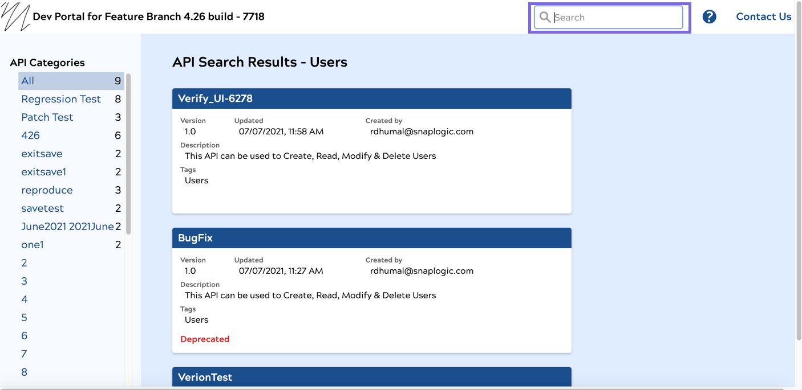
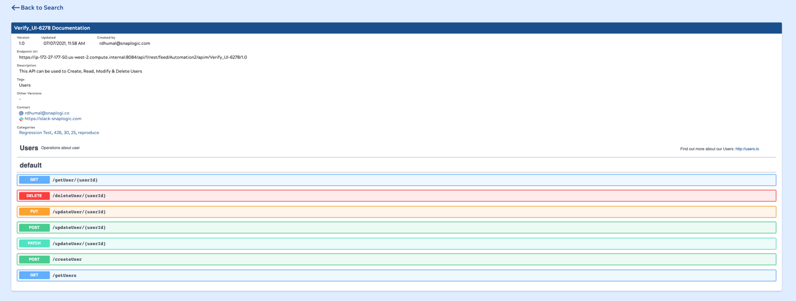

# API Catalog

## Browsing through the API Catalog

### Select A View

You can view the APIs that are available in the API Catalog by selecting on of the following two view:

* **Grid View**: In this view, APIs are represented by tiles that contain details about the API, such as the version, the creator, and when the API version was last updated. 
* **List View**: In this view, APIs are listed in a scrolling page with columns indicating the version, creator, last time updated, a truncated description which you can expand, and tags.

### Searching for APIs

You can search the API catalog for APIs using search terms.

1. In the top right corner of the API catalog, enter your terms in the Search field.  
2. Press Enter and search results are displayed. 
3. You can further filter the search results by clicking the available categories on the left navigation pane.

## Explore an API

You can view the details of any API by clicking anywhere on the API tile or its name when in the list view. Clicking the API displays the documentation of that API. 

The following details are provided for the API:

* **Version**: The version of the API.
* **Created by**: The creator of the API.
* **Updated**:The last time the API version was updated.
* **Endpoint Uri**: The endpoint by which you can invoke the API.
* **Description**: A description of the API functionality.
* **Tags**: Metadata labels of the API used to categorize the API contents.
* **Other Versions**: The previous versions of the API.
* **Contact**: The contact information \(email and Slack\) of the administrator of the API.
* **Categories**: The API Catalog categories under which the API falls.

You can also view the various HTTP methods of the API below the details.

To return back to the API catalog, click **Back to Search** on the top left corner of the page.

